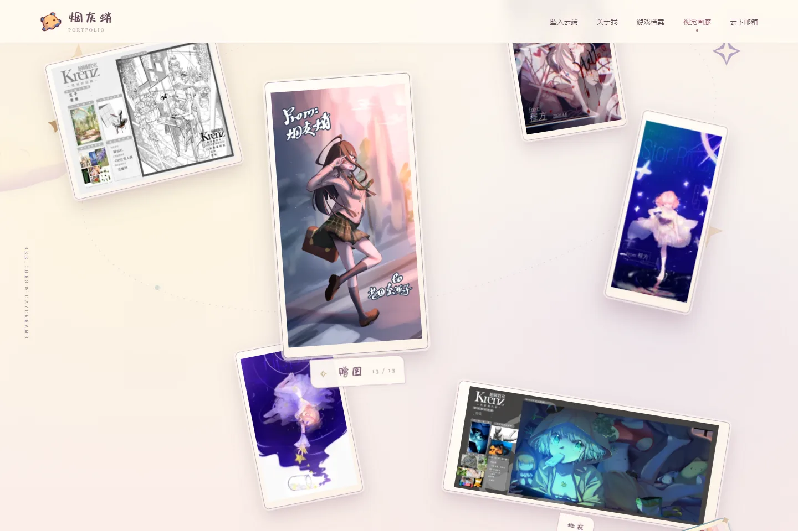

<p align="center"></p>

<h1 align="center">烟灰蛸 · 个人作品集</h1>

<p align="center">
  <i>The world is Azkaban, stories are parole.</i><br>
  游戏策划 · 人物美术 · 绘画
</p>

<p align="center">
  <a href="https://grimpoteuthis.pages.dev/">进入作品集</a> ·
  <a href="docs/MAKING_OF.md">制作过程</a> ·
  <a href="#本地预览">本地预览</a> ·
  <a href="DEPLOYMENT.md">发布说明</a> ·
  <a href="ASSET_LICENSE.md">素材版权</a>
</p>


入场设计灵感来自 [P3R 官网](https://p3re.jp/)。
[制作过程](docs/MAKING_OF.md)记录了最初的原画排版、手绘分镜、AI 占位，以及头图、自我介绍、水流和邮箱的多轮变化。

## 在这里看什么

| 板块 | 内容 |
| --- | --- |
| 坠入云端 | 入场动画、人物重影与首页 |
| 关于我 | 自我介绍、兴趣与分层浮动气泡 |
| 游戏档案 | 六个项目，独立详情页展示演示、玩法、策划与美术材料 |
| 视觉画廊 | 插画、角色设计与赠图；点选切换，点击主画查看完整大图 |
| 云下邮箱 | 写邮件、复制邮箱地址，以及 bilibili、GitHub 入口 |



页面支持桌面与手机布局、键盘操作，以及系统的减少动态效果设置。画作数量由数据决定，可以继续增加。

## 本地预览

需要 **Node.js 20 或更新版本**。网站没有第三方运行依赖，无需先安装依赖包。

```sh
git clone https://github.com/CF-612/grimpoteuthis-portfolio.git
cd grimpoteuthis-portfolio
npm run build
npm start
```

打开 [localhost:4173](http://localhost:4173/)。预览服务也支持局域网访问；端口可通过 `PORT` 环境变量修改。

```sh
npm run check
```

检查会重新构建，并验证详情页、分享信息、内部导航、资源引用、画作大图格式和字体许可。浏览器验收另行记录在 [RELEASE_REVIEW.md](RELEASE_REVIEW.md)。

## 修改与维护

| 文件 | 用途 |
| --- | --- |
| `design/index-v2.html` | 首页唯一可编辑模板 |
| `design/data.js` | 游戏与画作的数据；新增画作加入 `arts` 数组 |
| `design/games/*.html` | 游戏详情页正文 |
| `design/assets/` | 图片、视频、图标和字体子集 |
| `design/design.js` | 文件夹、画廊、邮箱与滚动交互 |
| `design/intro.js`、`intro-flow.js` | 入场动画 |
| `design/*.css` | 页面样式，加载顺序由模板确定 |
| `site.config.json` | 公开网址与分享卡片配置 |
| `build-local-release.cjs` | 构建网站、检查资源，生成 `dist/` |

修改后重新构建。`design/index.html` 和 `dist/` 是生成文件；每次构建会重新生成 `dist/`，不要在其中编辑源码。

新增画作时准备三份 WebP：缩略图放入 `thumbs/`，画廊展示图放入 `stage/`，完整尺寸大图放入 `originals/`，然后在 `arts` 中填写名称和路径。原始绘画文件保留在作者本地。

字体按页面文字裁剪过。新增文字出现缺字时，需要补充对应字体子集，并保留字体许可。

## 发布

网站使用 **Cloudflare Pages Direct Upload**，发布目录为 `dist/`，地址为 [grimpoteuthis.pages.dev](https://grimpoteuthis.pages.dev/)。GitHub 保存源码；推送提交后，需另外发布网站。更新步骤见 [DEPLOYMENT.md](DEPLOYMENT.md)。

## 许可与复用

- **代码：** HTML、CSS、JavaScript 与构建脚本使用 [MIT](LICENSE)。
- **绘画与展示素材：** 绘画、人物、图标、截图和视频保留相应作者的版权。可以查看、克隆和在本地运行本项目；单独转载、改编、销售或用于自己的公开网站，需要获得相关权利人的许可。
- **字体：** 按各自许可使用，详见 [ASSET_LICENSE.md](ASSET_LICENSE.md)。MIT 不覆盖素材和字体。

复用代码时，请换成自己的作品、联系方式和品牌素材。
