

<h1 align="center">从草图到云端</h1>

烟灰蛸作品集 · 制作过程 <a href="../README.md">返回仓库首页</a> · <a href="https://grimpoteuthis.pages.dev/">看看完成的网站</a>

这个网站从几张手绘示意图开始：先有水流与坠落的开场，再露出人物头图，往下是自我介绍、游戏文件夹、错落的画廊和云下邮箱。

构图、人物和视觉方向由我绘制与确认。AI 生图先用于临时占位，代码在 AI 协助下逐步实现；自己的素材画好后，再替换临时图，继续调整布局、层次和动效。

**原稿与分镜 → AI 占位与早期设计 → 手绘素材接入 → 细节优化 → 检查并上线**

### 从最初的规划开始

我想做的不只是一个投递用的作品目录，也想让它成为自己的游戏与绘画展示空间。规划中明确了用网名“烟灰蛸”作为网站品牌，把游戏项目和视觉作品作为主要内容，再加入自我介绍与联系方式。

**入场设计的灵感来自 [《Persona 3 Reload》（P3R）官网](https://p3re.jp/)**，尤其是它流畅的转场节奏和清新感。我结合自己的角色与世界观重新画了分镜，把开头改为留白文字、从顶部逐股落下的粉色水流，再接坠落人物与动态头图。粉色、奶油黄和浅紫围绕自己的画面展开。

游戏目录逐渐定为错层文件夹；画廊则想做成“群星环抱恒星”，通过移动、缩放和层次变化切换焦点。原始示意图用于表达想法，实际页面继续根据浏览效果调整。

## 01 · 先把想法画下来

### 开场：空白、细流、水幕、坠落

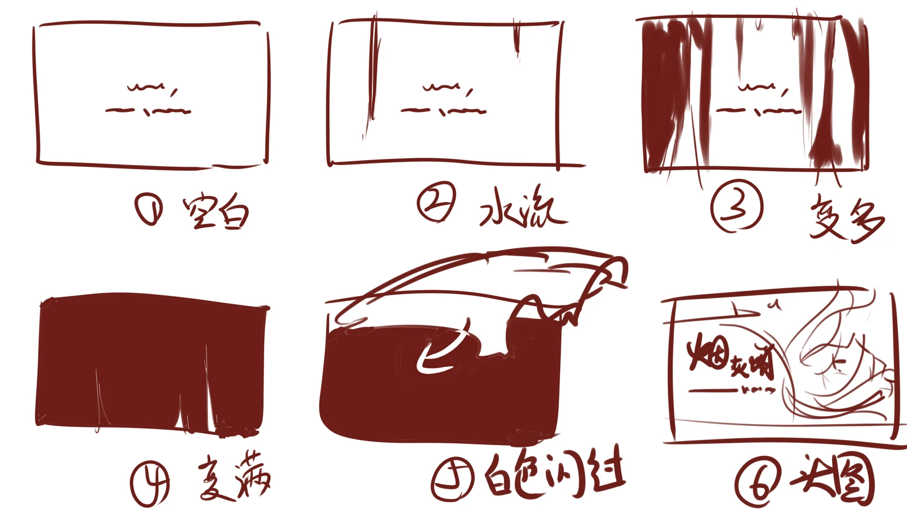

分镜从留白开始，水流逐渐变多，铺成完整的色幕，再让白色人物与裙摆向下经过，露出头图。后来开场文案定为两行“世界是阿兹卡班，故事是假释”，两个关键词各有强调色。

### 各个板块的构图

| 头图 | 自我介绍 |
| --- | --- |
| 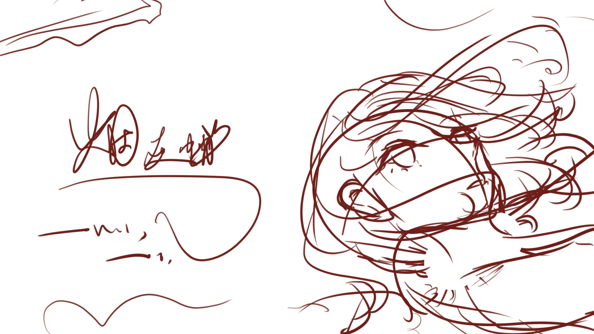 | 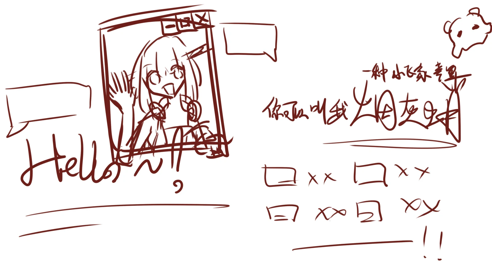 |
| 左边放标题，右边是人物与飘起的头发。 | 人物从网页窗口探出来，气泡散在周围。 |

| 视觉画廊 | 云下邮箱 |
| --- | --- |
| 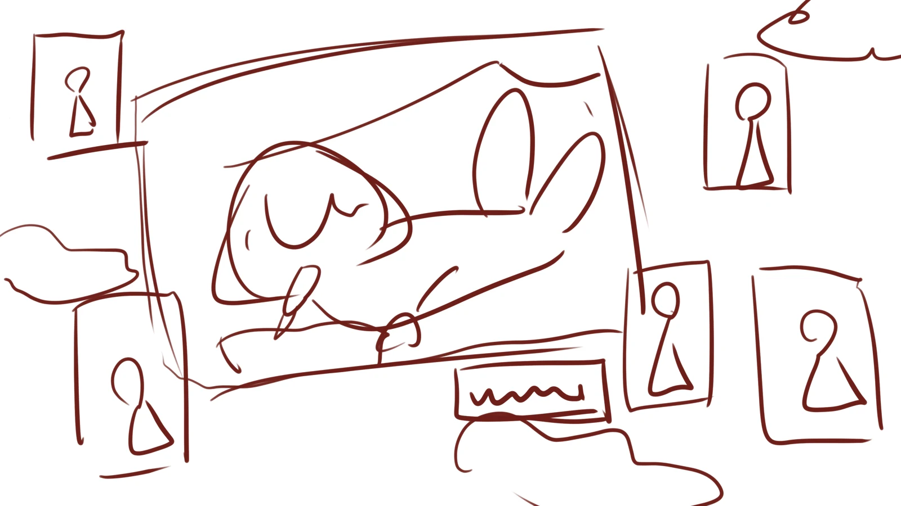 | 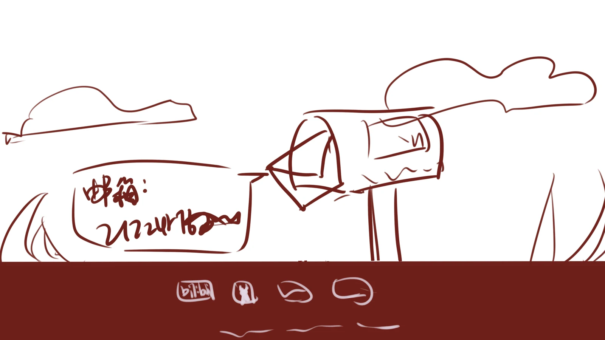 |
| 主画与周围小画错落摆放，留出切换与移动的空间。 | 侧着的长筒邮箱，打开后出现信封和联系方式。 |

这些示意图确定了网站的基本布局。后续修改也一直围绕人物朝向、画作遮挡和开门方向这些具体细节进行。

## 02 · 先用 AI 图片占位，试出页面

### 更早的第一版：直接用角色原画试排版

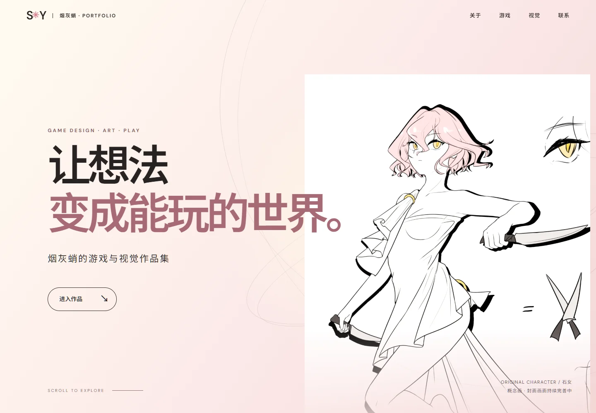

这是从最初规划对话的 **2026 年 9 月 29 日首次页面写入记录**恢复的头图：右侧直接裁切我的《石女》角色原画，左侧是大标题、介绍与入口。它比下面的 AI 坠落人物版更早，也早于后来单独重设计的页面。

这一版只是试排版的原型，标题是当时的临时文案，尚未形成后来手绘、云朵与坠落的视觉方向。展示图按恢复的 HTML/CSS 重新渲染，隐去旧页面中的实名并换成网名；它不是当时保存的截图。

### 接着重设计：让 AI 人物临时站到画面里

人物还没画完时，用 Imagegen 生成了临时人物，先检查颜色、留白、画面方向和页面滚动的关系。

| 头图占位 · 第一版 | 头图占位 · 调整方向后 |
| --- | --- |
|  |  |

两张图是当时保留下来的实际生成素材。后一版以第一版为参考，调整人物朝向和衣服衔接，用于早期设计稿。

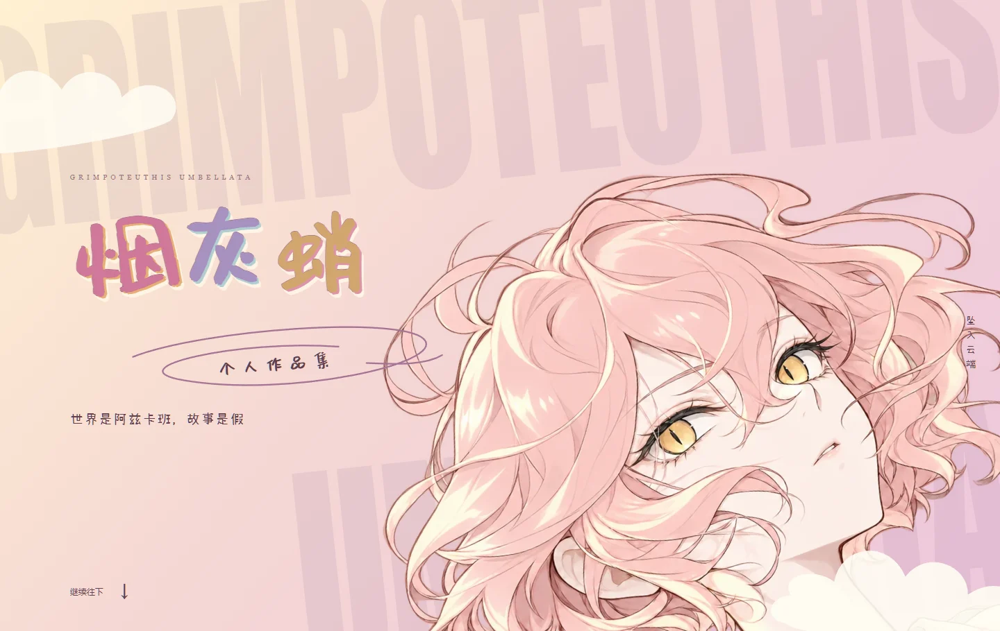

这是下一阶段首次新增的设计页面重渲染：AI 人物放大在右侧，左侧是彩色手写标题与圈出的“个人作品集”，背景开始加入学名与云朵。它仍早于后面的棕色玻璃字标与手绘人物版。

| 自我介绍人物占位 | 云朵占位的两种尝试 |
| --- | --- |
|  |   |

云朵也试过偏写实和二维平涂的版本，后来转向更贴近手绘页面的轮廓。**这一节展示的是 AI 临时素材，与下一节的本人手绘原稿分开标注。**

### 早期开场设计稿

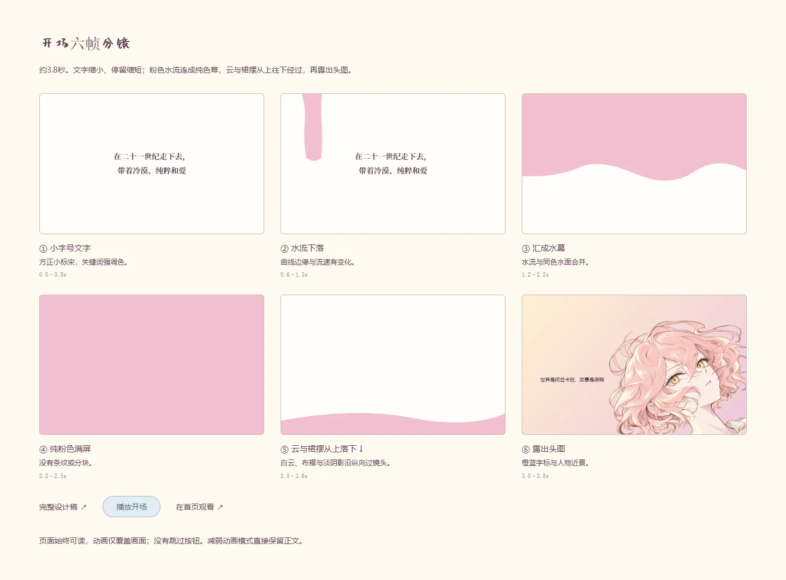

这是根据保留的 `storyboard-v3.html` 重新渲染的六帧设计稿：旧文案、简化水幕和 AI 头图仍可见。它展示早期设计思路，排版使用当前保留的样式与字体，并不是完整旧网站的历史截图。

## 03 · 把自己的画接进来

### 坠落人物与重影

| 上色人物 | 纯色重影 |
| --- | --- |
|  | 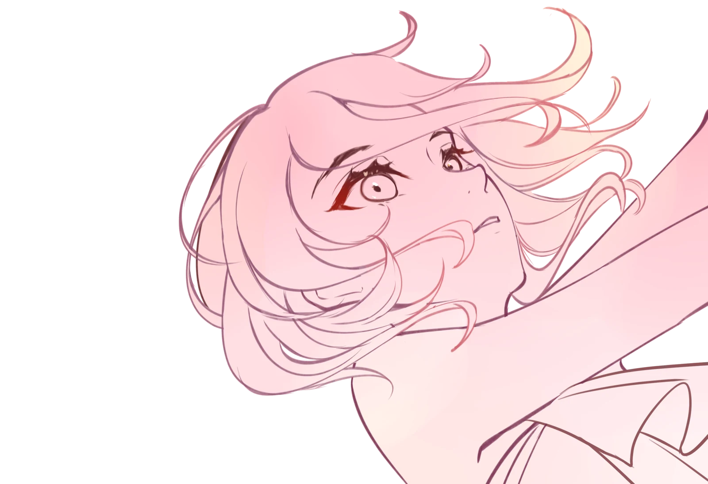 |

两张素材用在不同层级：上色人物放在前面，纯色版放大、后移并降低透明度，露出重影的眼睛和轮廓。前景人物缩小后，也能看到更多头发、肩膀与身体。

| 开场使用的纯白版本 | 自我介绍的组合参照 |
| --- | --- |
|  | 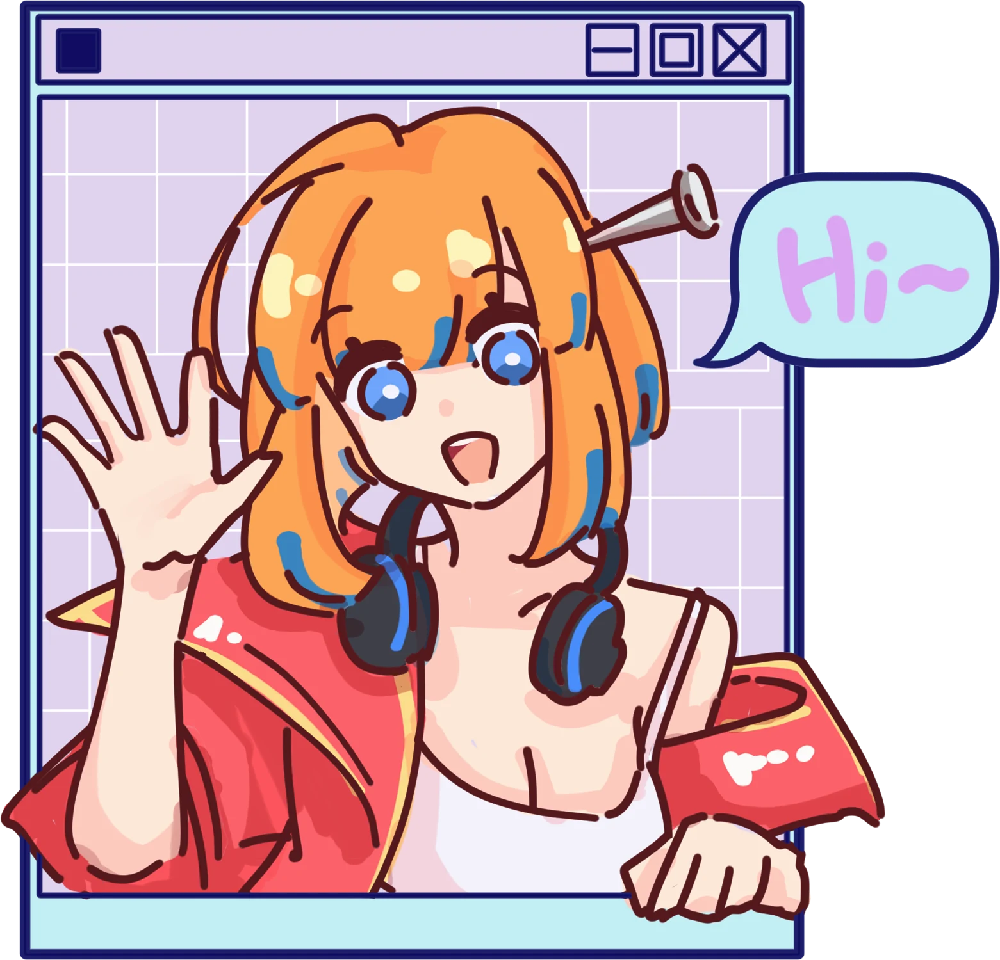 |

### 把人物、窗口和气泡拆开

| 人物 | 网页窗口 | Hi 气泡 |
| --- | --- | --- |
|  | 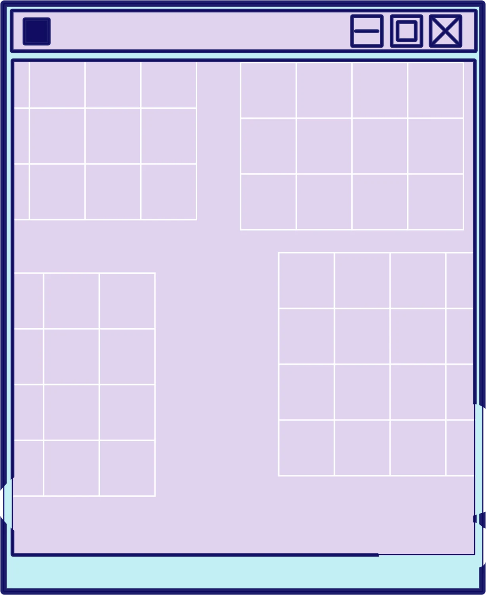 |  |

拆成独立素材后，气泡可以在网页前、人物后漂浮，避免挡住举起的手掌。位置按同一个构图画布计算，让页面缩放时人物与气泡保持关系。

新版烟灰蛸图标也替换到导航、页面装饰和浏览器图标中。`.clip` 分层工程和 PNG 原稿继续保留在本地；这里展示的是由原稿导出的缩放副本。

## 04 · 继续调整，直到像自己的页面

这一阶段有多轮来回修改。Astra 重点美化了头图字标、开场水流、自我介绍的信息区、云下邮箱，以及导航、画框和标签等局部细节。我再根据预览效果提出调整：保留满意的构图，修正重影、遮挡、缩放和板块衔接。后面的迭代也继续保留这些修改。

| 部位 | 修改内容 |
| --- | --- |
| 首页 | 缩小人物和字标，露出重影眼睛；调整标题、个人作品集标签与英文句子的排版。 |
| 开场与衔接 | 水流逐股加入、逐渐汇合；纯白人物穿过层云。首页云朵随滚动逐片进入，云形边缘分别适配桌面和手机。 |
| 自我介绍 | 气泡改为粗线条，拆分素材后重新安排遮挡与浮动。 |
| 游戏档案 | 修正文件夹边缘和文字比例；补充作者角色、独立标题、视频、TapTap 图文、策划节选与美术展示。 |
| 画廊 | 保留不平衡构图，加入画框、星饰与标签；缩略图尽量自动居中，预览条改为弧形。作品数量随数据扩展。 |
| 邮箱 | 调整本体透视、左侧开门与信封大小；简化寄信箭头，社交入口改为黄色线框图标。 |

### 头图：原画试排版、AI 占位、手绘大头，再到完整构图

上面的第一版与首次重设计，保留了最早的两个方向。接入自己的坠落人物后，又经历了大头过大、重影被遮住、标题占地过多等问题，继续调整人物的比例和前后距离。

| 手绘素材接入阶段 · 局部恢复 | 当前头图 |
| --- | --- |
| 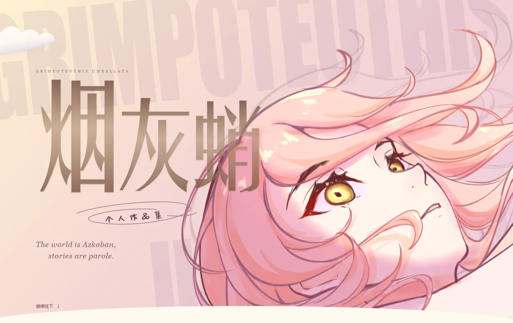 | 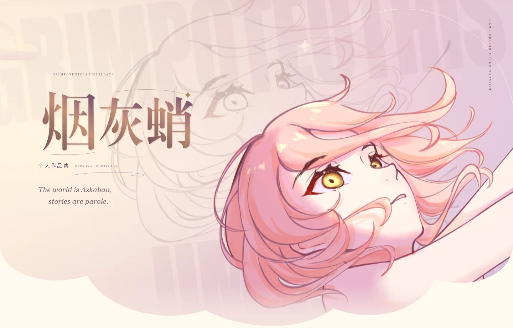 |

早期布局仍是大头、细长玻璃字和手写圈圈。后来缩小前景人物，把纯色重影移远，让眼睛露出来；标题、英文句子和作品集标签一起重新排版，逐渐转为更轻的风格。下图展示实际保留的四份字标素材，统一尺寸排在一起。

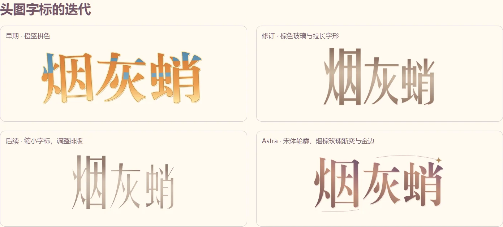

### 自我介绍：占位人物、手绘接入、拆层与信息纸张

| AI 占位阶段 · 初始页面恢复 | 手绘接入阶段 · 局部恢复 |
| --- | --- |
| 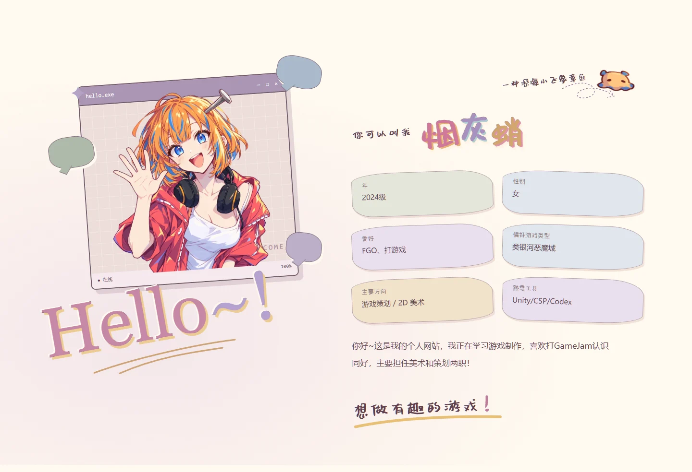 |  |

早期用 AI 人物试窗口构图，信息区是气泡标签与方框。自己的窗口人物接进来后，继续修正气泡的位置与粗线条风格；再把人物、窗口、Hi 气泡拆成独立层，让气泡在窗口前、人物后漂浮，手掌能完整露出。

Astra 将右侧信息区改成纸张样式，随后又调整了页面缩放时的相对位置、英文小标题与板块衔接。

### 云下邮箱：从简单色块到侧视邮箱，再到最后的纸信

| 最初的简单色块邮箱 · 初始页面恢复 | 本体与透视修订 · 局部恢复 |
| --- | --- |
| 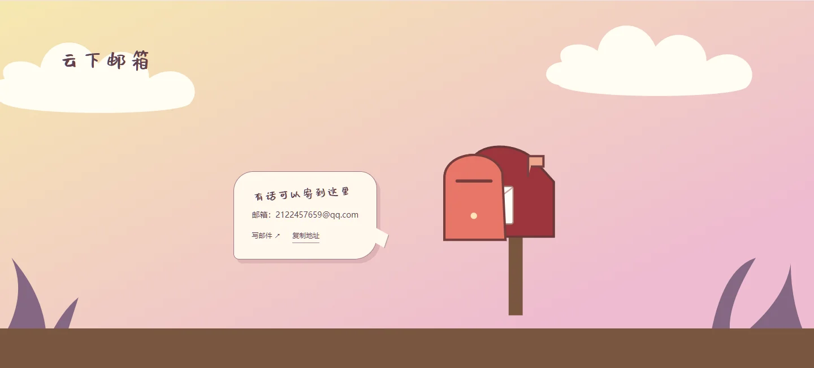 | 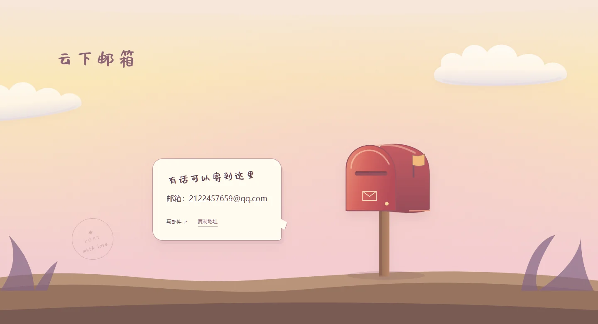 |

最初只是方形色块和一个信封。后来把邮箱本体改成长筒侧视形状，反复修正左侧开门、门与信封的遮挡、对话框箭头和寄信提示。

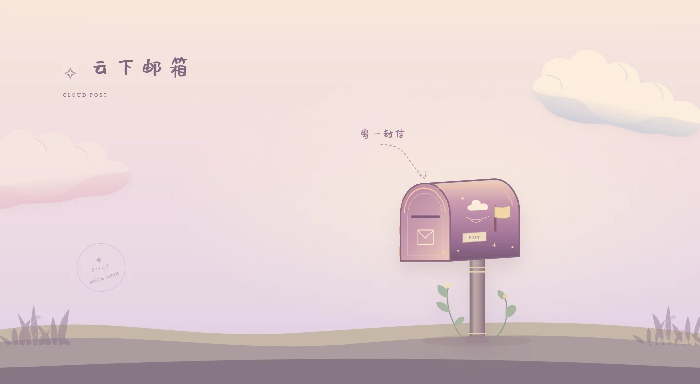

Astra 进一步调整紫灰与玫瑰色、高光、纸张和植物细节。最终保留一条虚线寄信箭头，Bilibili 与 GitHub 使用黄色线框图标。

**这些旧页面对照的边界：** 初始页面从保存的首次文件内容恢复；手绘接入阶段根据保留的布局、样式和素材替换记录恢复相应局部，并非完整旧版发布包。旧版文字缺少的字体使用系统字体回退，展示图关闭浮动动效。当前图片直接截取实际页面。

### 水流和第五幕，经过了多轮迭代

从保留的脚本和早期写入记录中，恢复了下面五个可以确认的开场阶段。**v21 的水流已经是新版**；对比旧水流，使用的是更早的实际函数。它们在统一画幅与相同时刻重新渲染，便于看清变化。

| 阶段 | 水流与转场的变化 |
| --- | --- |
| 早期实现 | 两股细流先落下，再用一整片波浪色幕铺满；第五幕是简化的白色裙摆轮廓。 |
| 细流与布褶修订 | 改为五股错时下落的水流，再接汇合色幕；白色裙摆按纵向移动，增加布褶与轮廓。 |
| v11 · 手绘素材接入 | 水流沿用上一轮；第五幕换成更细致的布料 SVG，人物头图接入自己的手绘素材。 |
| v20 · Astra 重做水流 | 水流自身加速下落、沿路径扩宽并相互汇合，自然覆盖屏幕；白色布幕连续揭开头图，约 3.9 秒。 |
| v21 · Astra 优化第五幕 | 延续 v20 水流，加入自己绘制的纯白坠落人物、淡紫层云和柔和阴影，整段放缓到约 4.4 秒。 |

动图以两倍慢速播放三种恢复出的水流逻辑，从少量细流到铺满屏幕。下面的静帧取相同的四个时刻。

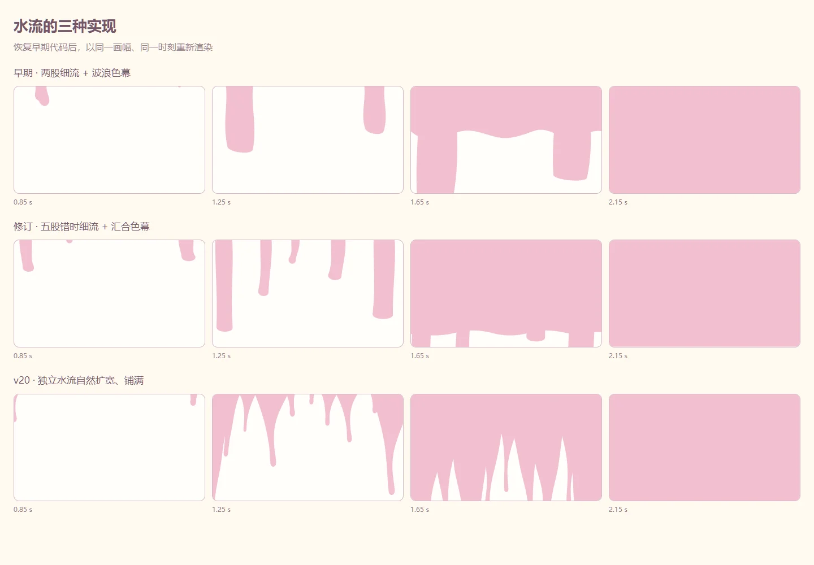

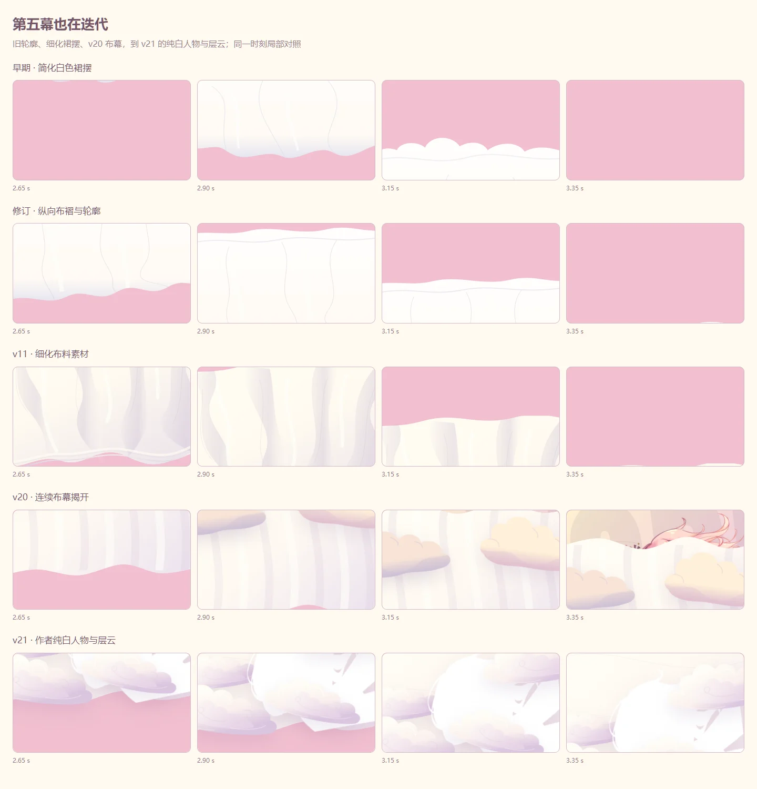

第五幕对照使用恢复出的轮廓函数、v11 布料素材、v20 开场代码和当前 v21 代码。这些是局部重渲染，字体与展示排版统一处理；原始绘画、轮廓与时间参数保留。恢复代码及来源说明保存在 [历史材料目录](process/history/README.md)。

### 有版本记录的前后对照

以下 v21 图片从 Git 提交 [`e904f90`](https://github.com/CF-612/grimpoteuthis-portfolio/tree/e904f901fa7f1adb282a3f0b080e902a51ff8b4e) 重建后截取。当前版本包含 v23 的优化和新增《赠图》。两边采用相同的浏览器尺寸，方便比较。

| v21 · 较早的可追溯版本 | 当前版本 |
| --- | --- |
| 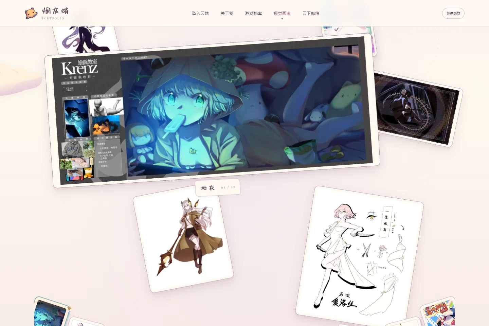 | 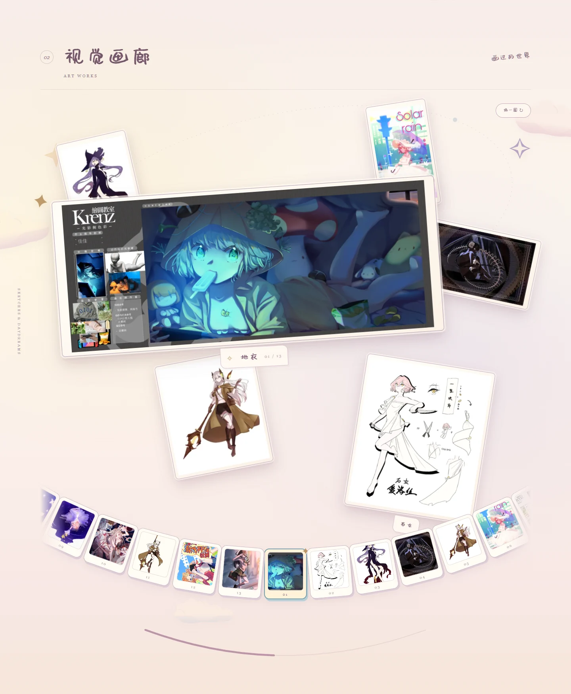 |
|  | 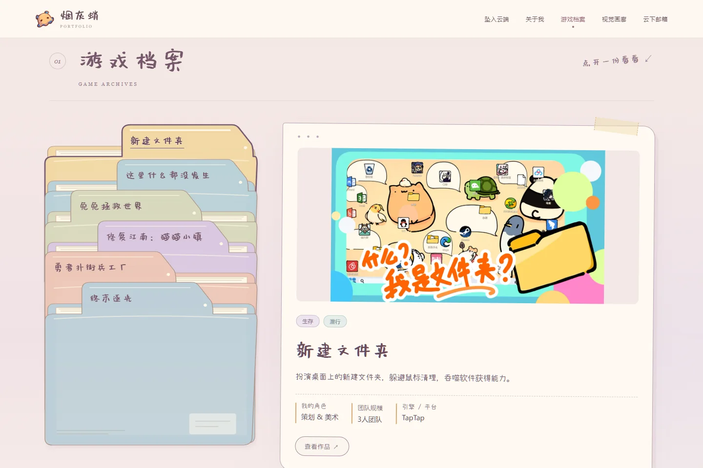 |

v21 已经换成手绘素材并采用新版水流。更早的全站截图没有完整保留下来，因此上文使用仍保留的实际占位图、早期分镜，以及恢复旧代码后生成的局部对照展示那个阶段。

### 从手绘分镜到可播放的开场

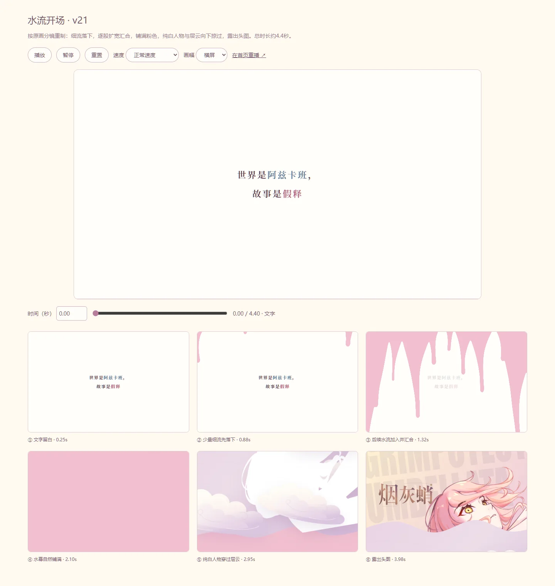

分镜页可以播放、暂停、拖动时间轴，也能切换横屏和竖屏，逐帧检查水幕覆盖和人物经过的时机。[打开开场演示](https://grimpoteuthis.pages.dev/storyboard.html)。

## 05 · 检查，压缩，再上线

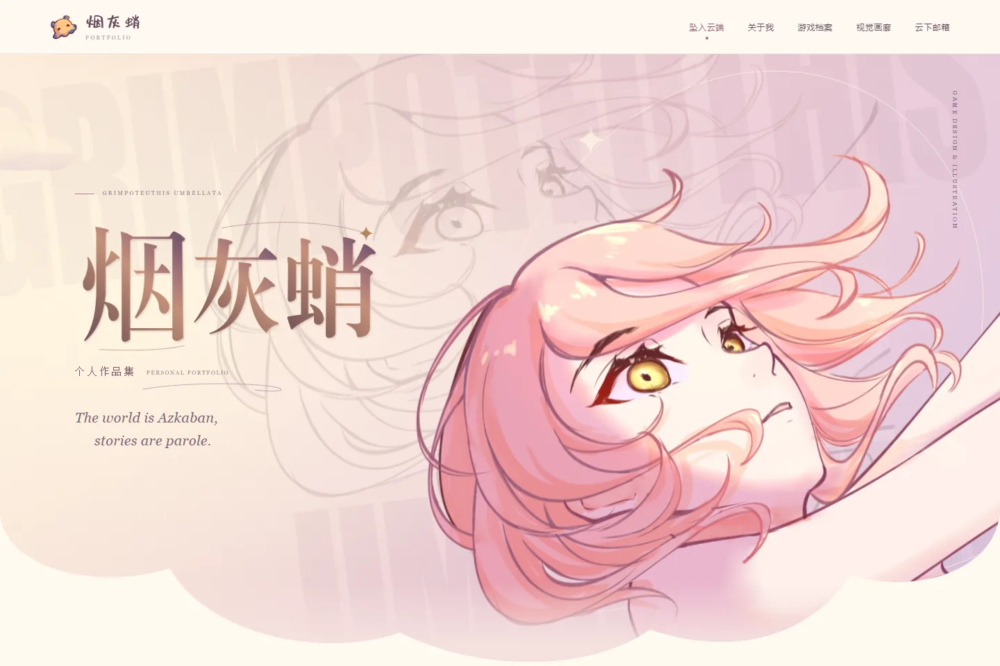

- 画作分别准备缩略图、舞台展示图和完整尺寸 WebP，保留原始绘画文件。
- 检查六个游戏详情页、图片解码、演示视频、返回导航与作者角色。
- 在桌面和手机模拟尺寸检查布局、大图弹层与入场动画。
- 代码使用 MIT，绘画与展示素材保留相应版权。
- 源码发布到 GitHub，网站通过 Cloudflare Pages 上线。

现在可以在 [grimpoteuthis.pages.dev](https://grimpoteuthis.pages.dev/) 查看网站。后续新画作和新项目会继续加进来。

---

**材料说明：** 草图与手绘人物来自作者保留的原稿；AI 占位来自实际生成文件；最初规划原型与首次重设计从首次写入记录恢复；旧版头图、自我介绍、邮箱、水流与裙摆从保存的文件内容和修订脚本恢复后渲染；v21 页面根据指定 Git 版本重建；当前页面与分镜由浏览器实际截取。绘画展示副本仅缩放和压缩，未重新绘制。素材文件与来源对应关系见 [sources.json](process/sources.json)，版权说明见 [ASSET_LICENSE.md](../ASSET_LICENSE.md)。
